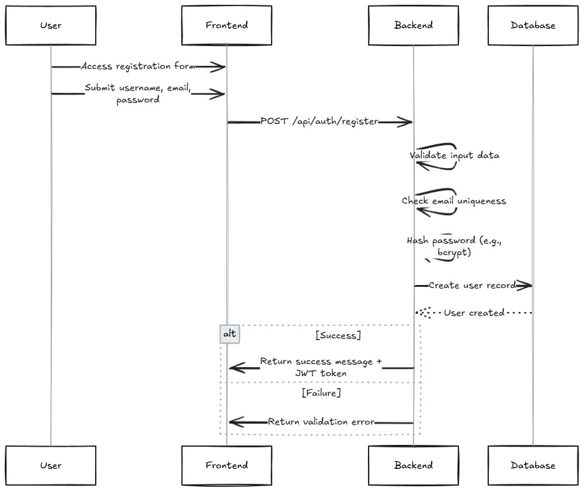

## 🧩 Detailed Workflow Specification for Scoreboard System

This specification expands on the system design features by detailing the internal workflow of each core functionality.

---

### 1. 👥 User Registration Workflow

**Purpose:** Allow new users to join the platform.

**Steps:**

1. User accesses registration form (frontend).
2. User submits username, email, password.
3. Backend endpoint (`POST /api/auth/register`) receives the data.
4. Password is hashed (e.g., bcrypt) and user is created in database.
5. Server responds with success message or validation error.
6. Optionally returns a JWT token for immediate authentication.

**Security:** Input validation + email uniqueness + password hashing.

---

### 2. 🔐 User Login Workflow

**Purpose:** Authenticate existing users.

**Steps:**

1. User submits credentials via login form.
2. Backend endpoint (`POST /api/auth/login`) checks credentials.
3. On success, server returns a JWT token.
4. Token is stored on client (e.g., in `localStorage` or `HttpOnly` cookie).

**Security:** Use JWT with expiry and signature. Rate-limit brute force attempts.

---

### 3. ✅ Score Update via User Action

**Purpose:** Legitimate actions performed by user should increase score.

**Steps:**

1. User completes an action on frontend.
2. Frontend dispatches authenticated request to `POST /api/score/increase`.
3. Backend verifies JWT and action validity.
4. Score is incremented in the database (`UPDATE users SET score = score + x`).
5. Backend queries top 10 scores and broadcasts update via WebSocket.
6. Server returns updated score to the client.

**Security:** Auth middleware to reject unauthenticated users.

---

### 4. 🔒 Secure Endpoint to Prevent Score Tampering

**Purpose:** Block unauthorized attempts to modify scores.

**Approaches:**

* Use JWT with signature verification.
* Implement RBAC if needed (e.g., only user can update their own score).
* Log abnormal requests (e.g., massive increments, frequency threshold).
* Apply rate-limiting middleware.

---

### 5. 📡 Live Scoreboard Display (Top 10)

**Purpose:** Show leaderboard in real-time to all clients.

**Steps:**

1. Frontend opens WebSocket connection to server (e.g., `ws://host/ws/leaderboard`).
2. Server tracks top 10 scores in memory or queries on update.
3. On every score change, top 10 is re-evaluated and broadcasted.
4. Clients receive update and rerender scoreboard.

**Alternative:** Use Server-Sent Events (SSE) for simpler push stream.

---

### 6. 📃 Scoreboard Initialization / Refresh

**Purpose:** Load scoreboard on initial page load or reconnect.

**Steps:**

1. Frontend calls `GET /api/scoreboard/top10`.
2. Backend queries database `SELECT * FROM users ORDER BY score DESC LIMIT 10`.
3. Response returns JSON array of top scorers.

**Optional:** Allow filters by region, time period, etc.

---

### 7. 💾 Persistent Score Storage

**Purpose:** Store score data for durability and analytics.

**Implementation:**

* Database table: `users (id, username, email, password_hash, score, updatedAt)`.
* Optional: Add table `score_history (user_id, delta, timestamp)` for audit/log.

**Note:** Use transaction-safe operations to avoid race conditions on score update.

---

### 📌 Improvements to Consider

* Introduce Redis caching for top 10 for fast access.
* Add Kafka or queue for high-scale score processing.
* Add analytics: track score trends over time.
* Role system: admin view vs user view.
* Webhook support: trigger event on leaderboard change.

---
